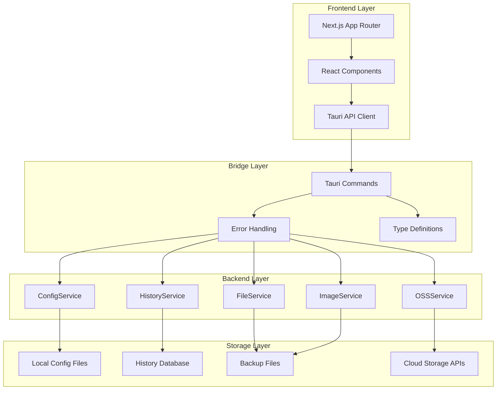
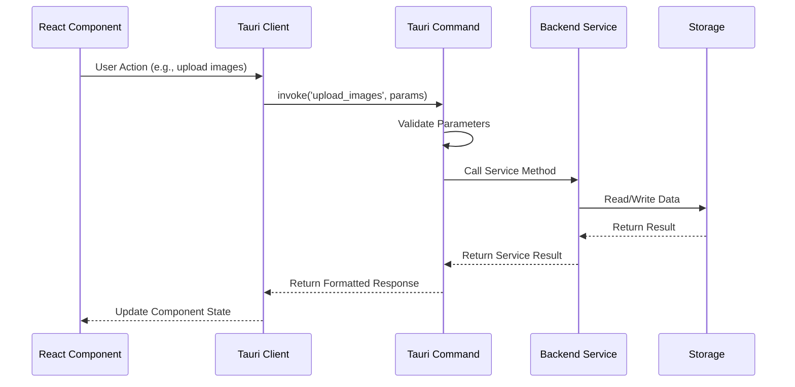

# Design Document

## Overview

This design outlines the integration architecture for migrating the existing Tauri backend services to work seamlessly with the new Next.js frontend for imgtoss. The application maintains its core functionality as a cross-platform image upload tool while providing a modern React-based user interface. The design ensures that all existing Tauri services (ConfigService, FileService, ImageService, OSSService, HistoryService) are properly integrated with the React components through Tauri's invoke system.

## Architecture

### High-Level Architecture



### Component Integration Flow



## Components and Interfaces

### 1. Tauri API Integration Layer

**Purpose**: Provide type-safe communication between React components and Tauri backend

**Key Files**:
- `lib/tauri-api.ts` - Centralized API client with typed methods
- `lib/types.ts` - TypeScript interfaces matching Rust structs
- `lib/error-handler.ts` - Unified error handling for Tauri commands

**Interface Design**:
```typescript
// Core API client structure
export class TauriAPI {
  // Configuration methods
  async saveOSSConfig(config: OSSConfig): Promise<void>
  async loadOSSConfig(): Promise<OSSConfig | null>
  async testOSSConnection(config: OSSConfig): Promise<OSSConnectionTest>
  
  // File operations
  async scanMarkdownFiles(filePaths: string[]): Promise<ScanResult[]>
  async uploadImages(imageIds: string[], config: OSSConfig): Promise<UploadResult[]>
  
  // History management
  async getUploadHistory(page?: number, pageSize?: number): Promise<PaginatedResult<HistoryRecord>>
  async exportHistory(): Promise<string>
  
  // Progress monitoring
  async getUploadProgress(taskId: string): Promise<UploadProgress | null>
}
```

### 2. React Component Enhancement

**Purpose**: Enhance existing React components to integrate with Tauri backend

**Storage Configuration Component**:
- Integrate with `ConfigService` through Tauri commands
- Real-time validation and connection testing
- Import/export functionality for configurations

**Image Upload Component**:
- File selection and drag-drop interface
- Progress tracking through Tauri progress system
- Integration with `ImageService` and `OSSService`

**History Component**:
- Paginated history display using `HistoryService`
- Search and filter capabilities
- Export functionality

**Dashboard Component**:
- System health monitoring
- Quick access to recent operations
- Statistics display

### 3. State Management Integration

**Purpose**: Manage application state with Tauri backend synchronization

**Implementation**:
- React Context for global state (configuration, upload progress)
- Local state for component-specific data
- Real-time updates through Tauri event system

```typescript
// Global state structure
interface AppState {
  config: OSSConfig | null
  uploadProgress: Map<string, UploadProgress>
  isConnected: boolean
  systemHealth: HealthStatus
}
```

### 4. Progress and Event System

**Purpose**: Real-time progress updates and system notifications

**Design**:
- Tauri event listeners for progress updates
- React state updates based on Tauri events
- User notifications for completed operations

## Data Models

### Core Data Structures

All data models are shared between Rust backend and TypeScript frontend:

```typescript
// Configuration
interface OSSConfig {
  provider: 'oss' | 'cos' | 's3'
  endpoint: string
  access_key_id: string
  access_key_secret: string
  bucket: string
  region: string
  path_prefix?: string
  compression_quality: number
  enable_compression: boolean
}

// Upload Operations
interface UploadResult {
  id: string
  original_path: string
  uploaded_url: string
  file_size: number
  upload_time: string
  checksum: string
  success: boolean
  error_message?: string
}

// History Records
interface HistoryRecord {
  id: string
  timestamp: string
  operation: string
  files: string[]
  image_count: number
  success: boolean
  backup_path?: string
  duration?: number
  total_size?: number
  error_message?: string
}
```

### Data Flow Patterns

1. **Configuration Flow**: UI → Validation → Tauri Command → ConfigService → Local Storage
2. **Upload Flow**: UI → File Selection → Tauri Command → ImageService/OSSService → Cloud Storage
3. **History Flow**: UI → Tauri Command → HistoryService → Local Database → UI Display

## Error Handling

### Error Classification

```typescript
enum ErrorType {
  VALIDATION = 'validation',
  NETWORK = 'network', 
  FILE_SYSTEM = 'file_system',
  SECURITY = 'security',
  SERVICE = 'service'
}

interface AppError {
  type: ErrorType
  message: string
  details?: string
  code?: string
  recoverable: boolean
}
```

### Error Handling Strategy

1. **Rust Layer**: Structured error types with detailed context
2. **Tauri Commands**: Error conversion to JSON-serializable format
3. **TypeScript Layer**: Type-safe error handling with user-friendly messages
4. **UI Layer**: Contextual error display with recovery options

### Recovery Mechanisms

- Automatic retry for network operations
- Backup restoration for file operations
- Configuration validation with correction suggestions
- Graceful degradation for non-critical features

## Testing Strategy

### Unit Testing

**Rust Backend**:
- Service layer unit tests for each service
- Command validation tests
- Error handling tests
- Mock external dependencies (cloud storage APIs)

**TypeScript Frontend**:
- Component unit tests with mocked Tauri API
- API client tests with mock responses
- State management tests
- Error handling tests

### Integration Testing

**Tauri Integration**:
- End-to-end command testing
- File system operation tests
- Configuration persistence tests
- Progress system tests

**UI Integration**:
- Component integration with real Tauri backend
- User workflow tests (upload, configuration, history)
- Error scenario tests

### Test Data Management

- Mock cloud storage responses
- Test configuration files
- Sample markdown files with images
- Test history records

## Security Considerations

### Input Validation

- Path traversal prevention in file operations
- Configuration parameter validation
- Rate limiting for API calls
- File type and size restrictions

### Data Protection

- Local storage encryption for sensitive configuration
- Secure credential handling
- Backup file protection
- History data privacy

### Network Security

- HTTPS enforcement for cloud storage APIs
- Certificate validation
- Timeout and retry policies
- Connection security monitoring

## Performance Optimization

### Frontend Performance

- Component lazy loading
- Virtual scrolling for large history lists
- Image thumbnail caching
- Debounced search and filtering

### Backend Performance

- Async operation handling
- Progress streaming for large uploads
- Database query optimization
- File operation batching

### Memory Management

- Streaming file uploads for large files
- Progress data cleanup
- History record pagination
- Backup file rotation

## Migration Implementation Plan

### Phase 1: Core Integration
- Set up Tauri API client
- Implement basic command integration
- Create shared type definitions

### Phase 2: Component Enhancement
- Enhance storage configuration component
- Implement upload progress tracking
- Add history management features

### Phase 3: Advanced Features
- Real-time progress updates
- Error recovery mechanisms
- Performance optimizations

### Phase 4: Testing and Polish
- Comprehensive testing
- UI/UX improvements
- Documentation updates