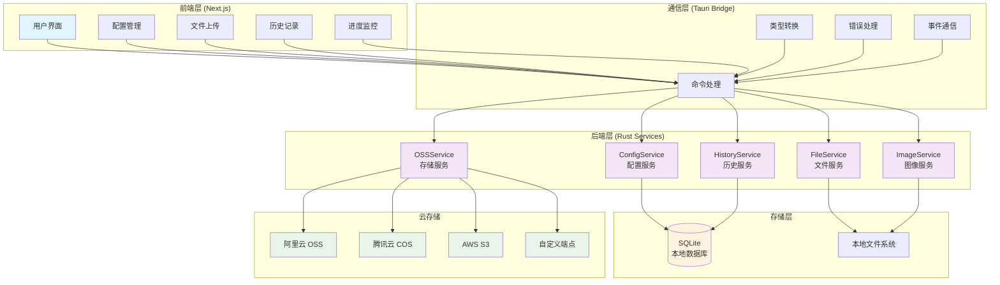

<div align="center">

# imgtoss

**现代化的图像上传管理工具**

一款基于 Next.js + Tauri 2 构建的跨平台桌面应用，专为自动化上传图像至对象存储服务而设计

[](https://opensource.org/licenses/MIT)
[](https://tauri.app/)
[](https://nextjs.org/)
[](https://www.rust-lang.org/)

[下载应用](#安装) • [使用文档](docs/) • [功能特性](#核心功能) • [开发指南](#开发)

</div>

---

## 为什么选择 imgtoss？

imgtoss 是一款专为内容创作者和开发者设计的图像管理工具，解决了在写作和开发过程中图片上传和管理的痛点：

- 🚀 **一键批量上传** - 告别逐个上传图片的繁琐操作
- 📝 **Markdown 智能处理** - 自动解析并替换文档中的本地图片链接
- ☁️ **多云存储支持** - 支持阿里云 OSS、腾讯云 COS、AWS S3 等主流服务
- 🔒 **本地化运行** - 所有处理完全在本地进行，保证数据安全
- ⚡ **高性能体验** - Rust 后端 + React 前端，流畅的用户体验

## 核心功能

### 📄 Markdown 文档处理
- **智能扫描**: 自动识别 Markdown 文件中的本地图片引用
- **批量替换**: 上传完成后自动将本地路径替换为云存储 URL
- **安全备份**: 修改前自动创建备份，支持一键恢复
- **多文件支持**: 同时处理多个 Markdown 文件

### 🖼️ 图片上传管理
- **拖拽上传**: 直观的拖拽界面，支持批量选择
- **实时进度**: 显示每张图片的上传进度和状态
- **重复检测**: 基于 SHA256 校验和智能去重
- **链接复制**: 上传完成后一键复制图片链接

### ☁️ 多云存储集成
- **阿里云 OSS**: 完整支持阿里云对象存储服务
- **腾讯云 COS**: 兼容腾讯云对象存储
- **Amazon S3**: 支持 AWS S3 及 S3 兼容协议
- **自定义配置**: 灵活的存储服务端点配置

### 📊 历史记录与统计
- **完整追踪**: 记录所有上传操作的详细信息
- **智能搜索**: 按时间、文件名、状态等条件快速检索
- **数据导出**: 支持导出历史记录和配置文件
- **统计分析**: 上传量统计和存储使用情况

## 技术架构

imgtoss 采用现代化的技术栈，确保高性能和跨平台兼容性：



**前端技术**
- Next.js 15.2.4 + React 19 - 现代化的用户界面
- TypeScript - 类型安全的开发体验
- Tailwind CSS + Radix UI - 精美的响应式设计
- Zustand - 轻量级状态管理

**后端技术**
- Tauri 2.0 - 跨平台桌面应用框架
- Rust - 高性能系统级编程语言
- SQLite - 本地数据持久化存储
- Tokio - 异步运行时支持

## 安装

### 下载预编译版本

访问 [Releases 页面](https://github.com/voidovo/imgtoss/releases) 下载适合您操作系统的安装包：

- **Windows**: `imgtoss_x.x.x_x64_en-US.msi`
- **macOS**: `imgtoss_x.x.x_x64.dmg`
- **Linux**: `imgtoss_x.x.x_amd64.deb` / `imgtoss-x.x.x.AppImage`

### 系统要求

- **Windows**: Windows 10 或更高版本
- **macOS**: macOS 10.13 或更高版本
- **Linux**: Ubuntu 18.04+ 或其他现代 Linux 发行版
- **内存**: 最少 4GB RAM
- **存储**: 至少 100MB 可用空间

## 快速开始

1. **下载并安装** imgtoss 应用
2. **配置云存储** - 在设置页面添加您的云存储服务配置
3. **开始使用** - 选择 Markdown 文档或直接上传图片

详细的使用指南请参考 [使用文档](docs/)。

## 开发

### 开发环境准备

```bash
# 安装 Rust
curl --proto '=https' --tlsv1.2 -sSf https://sh.rustup.rs | sh

# 安装 Node.js 18+
nvm install 18 && nvm use 18

# 安装 pnpm
npm install -g pnpm

# 克隆项目
git clone https://github.com/voidovo/imgtoss.git
cd imgtoss

# 安装依赖
pnpm install

# 启动开发服务器
pnpm tauri dev
```

### 构建应用

```bash
# 构建生产版本
pnpm tauri build
```

### 项目结构

```
imgtoss/
├── app/                 # Next.js 页面和路由
├── components/          # React 组件
├── lib/                 # 工具库和 API 客户端
├── src-tauri/          # Tauri 后端代码
│   ├── src/commands/   # API 命令处理
│   ├── src/services/   # 业务逻辑层
│   └── src/models/     # 数据模型
└── docs/               # 项目文档
```

## 贡献

我们欢迎所有形式的贡献！请查看 [贡献指南](CONTRIBUTING.md) 了解如何参与项目开发。

## 许可证

本项目采用 [MIT 许可证](LICENSE)。

## 致谢

感谢以下开源项目为 imgtoss 提供的支持：

- [Tauri](https://tauri.app/) - 跨平台应用开发框架
- [Next.js](https://nextjs.org/) - React 应用框架
- [Rust](https://www.rust-lang.org/) - 系统编程语言
- [Radix UI](https://www.radix-ui.com/) - 无障碍 UI 组件库

---

<div align="center">

**如果 imgtoss 对您有帮助，请给我们一个 ⭐️**

</div>
