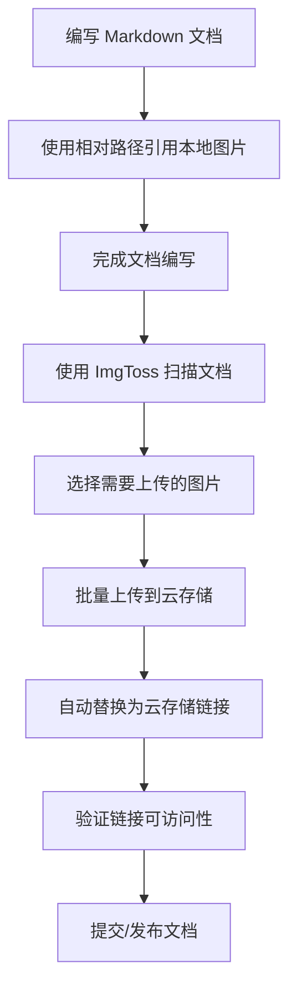

# 最佳实践指南

本指南汇总了使用 ImgToss 的最佳实践建议，帮助您高效、安全地管理图片上传工作流程。

## 云存储配置最佳实践

### 存储服务选择

#### 基于地理位置选择
```
国内用户推荐：
├─ 个人用户：阿里云 OSS (性价比高，文档完善)
├─ 企业用户：腾讯云 COS (企业级支持)
└─ 开发者：阿里云 OSS (免费额度较多)

海外用户推荐：
├─ 全球化需求：AWS S3 (覆盖范围广)
├─ 成本敏感：Cloudflare R2 (免费出站流量)
└─ 简单需求：DigitalOcean Spaces (简单易用)
```

#### 多云存储策略
```yaml
建议配置：
主存储: 阿里云 OSS (华东1-杭州)
  - 日常上传使用
  - 成本较低，速度快

备用存储: AWS S3 (us-west-2)
  - 重要文件备份
  - 海外访问优化

CDN 加速: 阿里云 CDN
  - 全球访问加速
  - 减少直接存储访问
```

### 安全配置

#### 权限最小化原则
```json
// 阿里云 OSS RAM 策略示例
{
  "Version": "1",
  "Statement": [
    {
      "Effect": "Allow",
      "Action": [
        "oss:PutObject",
        "oss:GetObject"
      ],
      "Resource": [
        "acs:oss:*:*:imgtoss-bucket/images/*"
      ],
      "Condition": {
        "StringEquals": {
          "oss:x-oss-content-type": [
            "image/jpeg",
            "image/png", 
            "image/gif",
            "image/webp"
          ]
        }
      }
    }
  ]
}
```

#### 访问密钥管理
```bash
# 密钥安全建议
1. 定期轮换访问密钥 (建议 90 天)
2. 为不同应用使用不同的密钥对
3. 启用多因素认证 (MFA)
4. 监控密钥使用情况

# 密钥存储
- ImgToss 使用 Tauri Stronghold 加密存储
- 定期备份加密的配置文件
- 不要在代码或配置文件中硬编码密钥
```

### 成本优化

#### 存储类型选择
```
实时访问图片:
└─ 标准存储 (Standard)
   - 博客图片、社交媒体图片
   - 需要即时访问

归档图片:
└─ 低频访问存储 (Infrequent Access)
   - 历史项目图片
   - 备份图片

长期存储:
└─ 归档存储 (Archive)
   - 不常访问的历史图片  
   - 合规要求的长期存储
```

#### 流量优化
```yaml
CDN 配置:
  缓存策略: 
    - 图片文件: 30 天
    - 缩略图: 7 天
  压缩设置:
    - 启用 Gzip/Brotli
    - WebP 自动转换
  
访问优化:
  - 使用 CDN 域名而非源站域名
  - 设置合理的缓存头
  - 启用预取和预加载
```

## 文件管理最佳实践

### 文件命名规范

#### 推荐的命名模式
```bash
# 日期 + 描述模式
screenshot-20240130-143022.png
diagram-architecture-20240130.jpg
photo-team-meeting-20240130.jpg

# 项目 + 功能模式  
imgtoss-ui-mockup-v1.png
blog-post-featured-image.jpg
docs-api-flow-diagram.svg

# 分类 + 序号模式
ui/button-states-01.png
ui/button-states-02.png
icons/social-media-icons-16px.png
```

#### 避免的命名方式
```bash
# 避免使用
IMG_001.jpg          # 无描述信息
屏幕截图.png          # 中文字符
file copy (2).jpg    # 空格和特殊字符
very-long-filename-that-exceeds-reasonable-length-limits.png  # 过长
```

### 目录结构组织

#### 本地文件组织
```
项目根目录/
├── assets/
│   ├── images/
│   │   ├── screenshots/     # 截图文件
│   │   ├── diagrams/       # 图表和流程图
│   │   ├── logos/          # 标志和图标
│   │   └── photos/         # 照片素材
│   ├── docs/
│   │   └── images/         # 文档专用图片
│   └── temp/               # 临时文件
└── backups/                # 备份文件
```

#### 云存储路径规划
```
Bucket: imgtoss-assets
├── images/
│   ├── 2024/
│   │   ├── 01/             # 按月份组织
│   │   │   ├── screenshots/
│   │   │   ├── diagrams/
│   │   │   └── photos/
│   │   └── 02/
│   ├── projects/
│   │   ├── project-a/
│   │   └── project-b/
│   └── shared/             # 共享资源
└── temp/                   # 临时上传区
```

### 版本管理

#### 文件版本控制
```bash
# 版本号后缀
logo-v1.0.png
logo-v1.1.png           # 小幅修改
logo-v2.0.png           # 大幅改版

# 状态标识
mockup-draft.png        # 草稿
mockup-review.png       # 待审核  
mockup-final.png        # 最终版本
mockup-approved.png     # 已批准
```

#### 备份策略
```yaml
本地备份:
  频率: 每日增量
  保留: 30 天
  位置: 外部硬盘或 NAS

云端备份:
  主存储: 阿里云 OSS (标准存储)
  备份存储: 腾讯云 COS (低频存储)
  跨区域备份: 开启

历史版本:
  保留策略: 保留最近 10 个版本
  自动清理: 超过 90 天的旧版本
```

## 工作流程优化

### Markdown 文档处理流程

#### 建议的工作流程


#### 批量处理技巧
```bash
# 1. 先整理本地图片
mkdir -p images/screenshots images/diagrams images/icons
mv *.png images/screenshots/
mv *.jpg images/photos/

# 2. 统一重命名
for file in images/screenshots/*.png; do
    mv "$file" "${file%.png}-$(date +%Y%m%d).png"
done

# 3. 批量处理多个 Markdown 文件
find . -name "*.md" -exec echo "Processing {}" \;
```

### 团队协作最佳实践

#### 共享配置管理
```json
// 团队共享配置文件 team-config.json
{
  "storageConfigs": [
    {
      "name": "团队主存储",
      "provider": "AliyunOSS", 
      "endpoint": "https://oss-cn-hangzhou.aliyuncs.com",
      "bucket": "team-assets",
      "customPath": "images/{year}/{month}/{user}/"
    }
  ],
  "namingRules": {
    "pattern": "{project}-{description}-{timestamp}",
    "dateFormat": "YYYYMMDD-HHmmss"
  }
}
```

#### 权限分配策略
```yaml
角色权限设计:
  管理员:
    - 完全访问权限
    - 配置管理
    - 用户管理
  
  编辑者:
    - 上传和下载权限  
    - 查看历史记录
    - 有限的删除权限
  
  查看者:
    - 只读访问权限
    - 下载权限
    - 查看历史记录
```

#### 协作规范
```markdown
## 团队图片管理规范

### 文件命名
- 使用项目前缀: [project]-[description]-[date]
- 避免中文和特殊字符
- 统一使用小写字母和连字符

### 目录结构
- 按项目分组: /projects/project-name/
- 按类型分类: /screenshots/, /mockups/, /assets/
- 按时间归档: /2024/01/, /2024/02/

### 上传规范
- 图片压缩: 质量 85%, 最大宽度 1920px
- 格式选择: 优先使用 WebP, 兼容性需求使用 JPEG
- 大小限制: 单文件不超过 5MB

### 审核流程
1. 上传到 temp/ 目录
2. 团队审核确认
3. 移动到正式目录
4. 更新相关文档
```

## 性能优化最佳实践

### 上传性能优化

#### 网络设置优化
```yaml
推荐设置:
  并发上传数: 2-3 个文件
  分片大小: 5MB (大文件)
  超时时间: 60 秒
  重试次数: 3 次
  重试间隔: 指数退避 (2^n 秒)

网络环境调优:
  有线网络: 并发数可设为 3-5
  WiFi 网络: 并发数设为 2-3  
  移动网络: 并发数设为 1-2
  企业网络: 根据带宽限制调整
```

#### 文件预处理
```javascript
// 自动压缩设置
const compressionSettings = {
  jpeg: {
    quality: 85,        // 质量 85% (推荐)
    maxWidth: 1920,     // 最大宽度
    maxHeight: 1080,    // 最大高度
    progressive: true   // 渐进式JPEG
  },
  png: {
    quality: 90,        // PNG 质量
    compressionLevel: 6, // 压缩级别
    stripMetadata: true  // 移除元数据
  },
  webp: {
    quality: 80,        // WebP 质量 
    lossless: false,    // 有损压缩
    alphaQuality: 90    // 透明度质量
  }
};
```

### 存储优化策略

#### 智能存储分层
```yaml
热数据 (频繁访问):
  存储类型: 标准存储
  典型场景: 
    - 博客文章图片
    - 产品展示图片
    - 社交媒体内容
  保留期: 长期

温数据 (偶尔访问):
  存储类型: 低频访问存储  
  典型场景:
    - 历史项目资料
    - 备份图片
    - 存档内容
  保留期: 1-3 年

冷数据 (很少访问):
  存储类型: 归档存储
  典型场景:
    - 合规要求的长期存储
    - 历史备份
    - 废弃项目资料
  保留期: 5+ 年
```

#### 生命周期管理
```json
// 阿里云 OSS 生命周期规则示例
{
  "rules": [
    {
      "id": "ImageLifecycle",
      "status": "Enabled",
      "filter": {
        "prefix": "images/"
      },
      "transitions": [
        {
          "days": 30,
          "storageClass": "IA"  // 30天后转低频
        },
        {
          "days": 365, 
          "storageClass": "Archive"  // 1年后转归档
        }
      ],
      "expiration": {
        "days": 2555  // 7年后删除
      }
    }
  ]
}
```

## 安全最佳实践

### 数据保护

#### 敏感信息处理
```bash
# 图片元数据清理
exiftool -all= *.jpg                    # 清除所有元数据
exiftool -gps:all= *.jpg               # 清除GPS信息
exiftool -Author= -Copyright= *.jpg    # 清除作者和版权信息

# ImgToss 自动处理
设置 → 隐私 → 自动清除元数据: ✅ 启用
设置 → 隐私 → 清除GPS信息: ✅ 启用
```

#### 访问控制
```yaml
Bucket 安全策略:
  公共访问: 仅允许 GetObject
  私有访问: 通过签名 URL 访问
  IP 白名单: 限制特定 IP 访问
  时间限制: 签名 URL 有效期 1 小时

防盗链设置:
  Referer 检查: 允许特定域名
  User-Agent 检查: 阻止异常 UA
  访问频率限制: 单IP限制访问频次
```

### 备份策略

#### 3-2-1 备份原则
```
3 份副本: 1个原始 + 2个备份
2 种媒介: 本地存储 + 云存储  
1 个异地: 不同地理位置的备份

具体实现:
├─ 本地原始文件 (主工作目录)
├─ 本地备份 (外部硬盘/NAS) 
├─ 云存储主副本 (阿里云华东)
└─ 云存储备份副本 (AWS美西)
```

#### 自动化备份脚本
```bash
#!/bin/bash
# 自动备份脚本

BACKUP_DIR="/backup/imgtoss"
DATE=$(date +%Y%m%d)

# 创建本地备份
rsync -av --delete ~/Documents/images/ $BACKUP_DIR/local-$DATE/

# 同步到云存储备份
aws s3 sync ~/Documents/images/ s3://backup-bucket/images/ --delete

# 清理超过30天的本地备份
find $BACKUP_DIR -name "local-*" -mtime +30 -exec rm -rf {} \;

echo "备份完成: $(date)"
```

## 监控和维护

### 使用情况监控

#### 存储使用统计
```yaml
定期检查指标:
  存储用量: 
    - 总体使用量
    - 各项目使用量  
    - 增长趋势分析
  
  流量统计:
    - 上传流量
    - 下载流量
    - CDN 流量
  
  成本分析:
    - 存储成本
    - 流量成本
    - 请求成本
```

#### 性能监控
```javascript
// 性能指标收集
const performanceMetrics = {
  uploadSpeed: [],      // 上传速度记录
  errorRate: 0,         // 错误率
  retryCount: 0,        // 重试次数
  averageFileSize: 0,   // 平均文件大小
  peakUsageHours: [],   // 高峰使用时段
};

// 自动告警阈值
const alertThresholds = {
  errorRate: 0.05,      // 错误率 > 5%
  uploadSpeed: 1.0,     // 上传速度 < 1MB/s
  storageUsage: 0.85,   // 存储使用率 > 85%
};
```

### 定期维护任务

#### 每周维护
```bash
# 1. 清理临时文件
rm -rf ~/Library/Application\ Support/com.kieran.imgtoss/temp/*

# 2. 检查数据库完整性
sqlite3 history.db "PRAGMA integrity_check;"

# 3. 更新缩略图缓存
# ImgToss → 设置 → 存储 → 重建缩略图缓存

# 4. 检查存储配置有效性
# ImgToss → 存储配置 → 测试所有连接
```

#### 每月维护
```bash
# 1. 导出历史记录备份
# ImgToss → 历史记录 → 导出 → JSON 格式

# 2. 清理过期日志
find ~/.local/share/com.kieran.imgtoss/logs/ -name "*.log" -mtime +30 -delete

# 3. 检查云存储成本
# 查看各云服务商的账单和使用报告

# 4. 更新访问密钥 (如需要)
# 根据安全策略轮换密钥
```

#### 季度维护
```yaml
存储优化:
  - 分析存储使用模式
  - 调整生命周期规则
  - 优化存储类型配置
  - 清理不需要的文件

安全审计:
  - 检查访问权限配置
  - 更新安全策略
  - 审查用户访问日志
  - 测试备份恢复流程

性能优化:
  - 分析上传性能趋势
  - 优化网络配置
  - 更新 CDN 设置
  - 调整并发参数
```

通过遵循这些最佳实践，您可以充分发挥 ImgToss 的功能，建立高效、安全、可维护的图片管理工作流程。定期回顾和调整这些实践，确保它们符合您的具体需求和业务发展。